# Design — Tsenta ATS Form Automator

Production-grade Playwright automation that fills job applications across ATS platforms with human-like behavior, anti-detection, and fault tolerance.

---

## Architecture Overview

```mermaid
graph TB
    subgraph Automator["🎯 Automator"]
        A[Load Profile] --> B[Create Stealth Context]
        B --> C[For Each Target URL]
        C --> D[Detect Platform]
        D --> E[Run Handler]
        E --> F[Capture Artifacts]
    end
    
    subgraph Core["⚙️ Core Layer"]
        G[log.ts<br/>Ora spinners]
        H[retry.ts<br/>Backoff + Circuit]
        I[stealth.ts<br/>Anti-detection]
        J[artifacts.ts<br/>Screenshots]
    end
    
    subgraph Engine["🤖 Engine Layer"]
        K[human.ts<br/>Bezier, typos, paste]
        L[fields.ts<br/>Form helpers]
        M[mappings.ts<br/>Value transforms]
    end
    
    subgraph Platforms["🏢 Platforms Layer"]
        N[base.ts<br/>Abstract Platform]
        O[acme.ts<br/>4-step wizard]
        P[globex.ts<br/>Accordion form]
    end
    
    Automator --> Core
    Automator --> Engine
    Automator --> Platforms
```

---

## Execution Flow

```mermaid
flowchart TD
    A([Start]) --> B[Load Candidate Profile]
    B --> C[Create Stealth Browser Context]
    C --> D{For Each Target URL}
    
    D --> E[Navigate to URL]
    E --> F[Detect Platform by URL Pattern]
    F --> G{Platform Found?}
    
    G -->|No| H[⚠️ Skip - Unknown ATS]
    G -->|Yes| I[Run Platform Handler]
    
    I --> J[Fill Form Fields]
    J --> K[Submit Application]
    K --> L[Extract Confirmation ID]
    
    L --> M{Success?}
    M -->|Yes| N[📸 Save Success Screenshot]
    M -->|No| O[🔴 Capture Failure Report]
    
    N --> P[Log Result]
    O --> P
    H --> P
    
    P --> D
    D -->|All Done| Q[Print Summary]
    Q --> R([End])
    
    style A fill:#10b981
    style R fill:#10b981
    style H fill:#f59e0b
    style O fill:#ef4444
    style N fill:#3b82f6
```

---

## Human Input Behavior

Varies input method based on content type — real humans don't behave consistently.

```mermaid
flowchart TD
    A[Input Text] --> B{URL or Email?}
    
    B -->|Yes| C[📋 PASTE<br/>Always paste links]
    B -->|No| D{Length < 50 chars?}
    
    D -->|Yes| E[⌨️ TYPE<br/>Character by character]
    D -->|No| F{Length ≤ 200 chars?}
    
    F -->|Yes| G{Random}
    G -->|70%| E
    G -->|30%| C
    
    F -->|No| H{Random Distribution}
    H -->|25%| I[⌨️ TYPE ALL<br/>Slow typer]
    H -->|30%| J[📋 PASTE ALL<br/>From document]
    H -->|25%| K[📋 PASTE + EDIT<br/>Fix a typo after]
    H -->|20%| L[⌨️ TYPE SOME → 📋 PASTE<br/>Give up halfway]
    
    K --> K1[Paste full text]
    K1 --> K2[Delete last char]
    K2 --> K3[Retype last char]
    
    L --> L1[Type 2-4 words]
    L1 --> L2[Pause... too slow]
    L2 --> L3[Select all + Paste]
    
    style C fill:#3b82f6
    style E fill:#10b981
    style I fill:#10b981
    style J fill:#3b82f6
    style K fill:#8b5cf6
    style L fill:#f59e0b
```

---

## Retry System

### Exponential Backoff

### Circuit Breaker States

```mermaid
stateDiagram-v2
    [*] --> Closed
    
    Closed --> Closed: ✅ Success
    Closed --> Closed: ❌ Failure (count < 3)
    Closed --> Open: ❌ Failures ≥ 3
    
    Open --> Open: 🚫 All calls rejected
    Open --> HalfOpen: ⏱️ Cooldown elapsed
    
    HalfOpen --> Closed: ✅ Test call succeeds
    HalfOpen --> Open: ❌ Test call fails
    
    note right of Closed: Normal operation
    note right of Open: Protect system
    note right of HalfOpen: Testing recovery
```

### Retry Profiles

---

## Mouse Movement

```mermaid
flowchart LR
    subgraph Bot["🤖 Bot Movement"]
        B1((Start)) --> B2((End))
    end
    
    subgraph Human["👤 Human Movement"]
        H1((Start)) --> H2((Control 1))
        H2 --> H3((Control 2))
        H3 --> H4((End))
    end
```

**Bot:** Straight line, constant speed — easily detected  
**Human:** S-curve, decelerates at end — natural motion

---

## Typeahead Interaction

### Fuzzy Scoring

| Score | Match Type | Example |
|-------|------------|---------|
| **100** | Exact | `"react"` = `"react"` |
| **80** | Prefix | `"react"` starts `"reactjs"` |
| **60** | Words | `"native"` in `"react native"` |
| **40** | Contains | `"act"` within `"react"` |
| **0-20** | Partial | Some characters match |

---

## Platform Pattern

### Platform Comparison

---

## Stealth Mode

```mermaid
flowchart LR
    subgraph Detection["🔍 Detection Vectors"]
        D1[navigator.webdriver = true]
        D2[Empty plugins array]
        D3[Straight mouse lines]
        D4[Instant typing]
        D5[Zero typos]
        D6[Fixed viewport]
        D7[Same user agent]
    end
    
    subgraph Patches["🛡️ Stealth Patches"]
        P1[webdriver = undefined]
        P2[Fake plugins array]
        P3[Bezier curves]
        P4[45-140ms delays]
        P5[2% typo rate]
        P6[Random viewports]
        P7[Rotated 2026 UAs]
    end
    
    D1 --> P1
    D2 --> P2
    D3 --> P3
    D4 --> P4
    D5 --> P5
    D6 --> P6
    D7 --> P7
```

---

## Artifacts Structure

---

## Adding a New Platform

```mermaid
flowchart LR
    A[1. Create file<br/>platforms/new.ts] --> B[2. Extend Platform<br/>abstract class]
    B --> C[3. Implement methods<br/>fill, submit, getConfirmation]
    C --> D[4. Call registerPlatform<br/>at module load]
    D --> E[5. Import in<br/>automator.ts]
    E --> F[✅ Auto-detects<br/>by URL pattern]
    
    style F fill:#10b981
```

---

## Key Decisions

