# Tsenta ATS Form Automator

A production-grade Playwright automation system that fills job application forms across multiple ATS platforms with human-like behavior and anti-detection measures.

## Demo Video

[](https://youtu.be/i6tDOE7rhXU)

> **Click to watch** — 3 min walkthrough showing both forms being automated with human-like behavior.

## Demo Results

```
✓ Acme Corp: ACM-MLJQF1JD-ZJ8Z (1.2m)
✓ Globex Corporation: GX-MLJQGM23-W6B (1.2m)
Run complete: 2/2 successful
```

---

## Quick Start

```bash
# Install dependencies
pnpm install

# Install Playwright browsers
npx playwright install chromium

# Run automation (starts server automatically)
pnpm start
```

That's it! The `start` command:
1. Spins up the mock ATS server
2. Waits for it to be ready
3. Runs the automation
4. Kills the server when done

### Testing

```bash
# Run tests once
pnpm test:run

# Watch mode
pnpm test

# With coverage
pnpm test:coverage
```

**60 tests** covering:
- Human behavior utilities (`randomBetween`, `gaussianRandom`, `shouldPaste`)
- Fuzzy scoring algorithm for typeahead matching
- Retry engine with exponential backoff
- Circuit breaker state machine
- Retry predicates for error classification

```
tests/
├── core/
│   └── retry.test.ts      # Retry engine, circuit breaker
└── engine/
    ├── fields.test.ts     # Fuzzy scoring algorithm
    └── human.test.ts      # Random utils, paste detection
```

---

## Architecture

```mermaid
graph TB
    subgraph Automator["🎯 Automator"]
        A[automator.ts] --> B[Load Profile]
        B --> C[Create Stealth Context]
        C --> D[Run Platform Handlers]
    end
    
    subgraph Core["⚙️ Core"]
        E[log.ts<br/>Ora spinners]
        F[retry.ts<br/>Backoff + Circuit]
        G[stealth.ts<br/>Anti-detection]
        H[artifacts.ts<br/>Screenshots]
    end
    
    subgraph Engine["🤖 Engine"]
        I[human.ts<br/>Bezier, typos, paste]
        J[fields.ts<br/>Form helpers]
        K[mappings.ts<br/>Value transforms]
    end
    
    subgraph Platforms["🏢 Platforms"]
        L[base.ts<br/>Abstract Platform]
        L --> M[acme.ts<br/>4-step wizard]
        L --> N[globex.ts<br/>Accordion form]
    end
    
    D --> Core
    D --> Engine
    D --> Platforms
```



### Execution Flow

```mermaid
flowchart LR
    A([Start]) --> B[Load Profile]
    B --> C[Create Stealth Context]
    C --> D{Each URL}
    D --> E[Detect Platform]
    E --> F[Fill Form]
    F --> G[Submit]
    G --> H{Success?}
    H -->|Yes| I[📸 Screenshot]
    H -->|No| J[🔴 Error Report]
    I --> D
    J --> D
    D -->|Done| K([Summary])
```



### Design Patterns

| Pattern | Where | Purpose |
|---------|-------|---------|
| **Strategy** | `Platform` abstract class | Swap platform implementations |
| **Template Method** | `Platform.run()` | Common flow with custom fill/submit |
| **Registry** | `registerPlatform()` | Auto-detect and dispatch |
| **Factory** | `createLog()`, `createStealthContext()` | Configured instances |

### Adding a New Platform

```typescript
// src/platforms/workday.ts
import { Platform, registerPlatform } from './base';

class WorkdayPlatform extends Platform {
  readonly name = 'Workday';
  readonly id = 'workday';
  readonly urlPattern = /workday\.com/;

  async fill(ctx: HandlerContext): Promise<void> {
    // Platform-specific form filling
  }

  async submit(ctx: HandlerContext): Promise<void> {
    // Submit logic
  }

  async getConfirmation(ctx: HandlerContext): Promise<string> {
    // Extract confirmation ID
  }
}

registerPlatform(new WorkdayPlatform());
```

---

## Features

### Human-Like Behavior


| Feature | Implementation |
|---------|---------------|
| **Smart paste vs type** | Auto-detects URLs/emails → pastes; names/text → types character-by-character |
| **Variable typing speed** | Gaussian distribution delays, faster for common words, slower for numbers |
| **Typo simulation** | 2% chance of adjacent key typo + backspace correction |
| **Bezier mouse curves** | Natural S-curve trajectories between points (not straight lines) |
| **Hover before click** | Brief pause over element before clicking |
| **Smooth scrolling** | Gradual scroll with easing, not instant jumps |
| **Reading pauses** | Random delays to simulate human reading/thinking |
| **Triple-click select** | Uses triple-click instead of Cmd+A for field selection |

### Stealth Mode

| Feature | Details |
|---------|---------|
| **Webdriver removal** | Deletes `navigator.webdriver` property |
| **Plugin spoofing** | Patches `navigator.plugins` and `navigator.mimeTypes` |
| **Language spoofing** | Sets realistic `navigator.languages` array |
| **Chrome runtime** | Simulates `window.chrome.runtime` |
| **Permissions API** | Patches `navigator.permissions.query` |
| **Viewport randomization** | Random resolution within common ranges |
| **User agent rotation** | Realistic Chrome UA strings |

### Reliability


| Feature | Details |
|---------|---------|
| **Retry engine** | Exponential backoff (300ms base, 8s max, 2x multiplier) |
| **Circuit breaker** | Opens after 5 consecutive failures, auto-recovers |
| **Retry profiles** | `standard`, `aggressive`, `gentle`, `quick` presets |
| **Error predicates** | Custom retry logic per error type |
| **Smart typeahead** | Progressive typing until dropdown appears |
| **Fuzzy matching** | Score-based selection (exact > starts with > contains) |
| **State-based waits** | Uses DOM state/visibility instead of fixed delays |
| **Scoped selectors** | `.form-step.active .btn` avoids ambiguous matches |

### Observability

| Feature | Details |
|---------|---------|
| **Ora spinners** | Clean animated loading indicators |
| **Colored output** | Green ✓, Red ✗, Yellow !, Cyan headers |
| **Step timing** | Duration tracked for each operation |
| **Video recording** | Full browser session capture |
| **Screenshots** | Captured on success and failure |
| **Error reports** | JSON with stack traces, URL, timestamp |
| **Run summary** | Final table with all platforms and results |

### Efficiency

| Feature | Details |
|---------|---------|
| **Single command** | `pnpm start` runs server + automation + cleanup |
| **Progressive search** | Types minimum chars needed for typeahead |
| **Batch chip selection** | Identifies all unselected → clicks without delays |
| **No hardcoded waits** | All delays use range + DOM state checks |
| **Smart paste** | URLs paste instantly instead of slow typing |

---

## Platforms Supported


### Acme Corp (`/acme.html`)
- 4-step wizard with progress bar
- Typeahead school field
- Checkboxes for skills
- Radio buttons with conditional fields
- File upload with drag-drop area

### Globex Corporation (`/globex.html`)  
- Single-page accordion layout
- **Async typeahead** with network delay + shuffled results
- Chip selectors instead of checkboxes
- Toggle switches instead of radios
- Salary slider (`<input type="range">`)

---

## Configuration

Edit `src/automator.ts`:

```typescript
const DEFAULT_CONFIG: RunConfig = {
  baseUrl: "http://localhost:3939",
  headless: false,        // Watch the browser
  slowMo: 0,              // Extra delay between actions
  recordVideo: true,      // Save video recordings
  stealthMode: true,      // Anti-detection patches
  keepBrowserOpen: 2000,  // View result before close
};
```

---

## Output

### Console
```
✓ Application Submitted Successfully
━━━━━━━━━━━━━━━━━━━━━━━━━━━━━━━━━━━
Platform: Acme Corp
Duration: 1.2m
Confirm#: ACM-MLJQF1JD-ZJ8Z
```

### Artifacts
```
artifacts/
├── videos/           # Full run recordings
├── screenshots/      # Success/failure captures
└── reports/          # JSON error reports
```

---

## Tools Used

- **Copilot** (Claude Opus 4.6) - Architecture design, implementation, debugging
- **Playwright** - Browser automation framework
- **Ora** - CLI spinner animations
- **Chalk** - Terminal colors
- **Concurrently** - Run server + automation in single command
- **Wait-on** - Wait for server before running automation

---

## Design Decisions

### Why paste URLs instead of typing?

Real humans copy-paste URLs from their browser or documents. Typing `https://linkedin.com/in/janedoe` character-by-character is MORE suspicious to bot detectors. Our system auto-detects URLs/emails and pastes them with realistic timing (pause before paste, verify pause after).

### Why Bezier curves for mouse movement?

Straight-line mouse paths are a bot signature. Humans naturally move in S-curves with acceleration and deceleration. We use quadratic Bezier curves with 15 intermediate steps.

### Why typos?

Perfectly typed text is suspicious. Real humans make mistakes. We simulate 2% typo rate (adjacent key on QWERTY) followed by immediate backspace correction. Rate is low enough to not trigger form validation issues.

### Why exponential backoff?

Network glitches and DOM timing issues are common. Linear retry hammers the system. Exponential backoff (300ms → 600ms → 1.2s → ...) is gentler and more effective.

### Why circuit breaker?

Prevents infinite retry loops. After 5 consecutive failures, we "open" the circuit and fail fast. Auto-recovers after cooldown period.

### Why fuzzy typeahead matching?

Globex's async school search returns shuffled results. Can't rely on exact position. Fuzzy scoring finds best match: exact(100) > startsWith(80) > wordsMatch(60) > contains(40).

---

## Trade-offs

| Decision | Rationale |
|----------|-----------|
| **Playwright over Puppeteer** | Better TypeScript support, auto-wait, trace viewer |
| **Abstract class over interface** | Enforces template method pattern with shared logic |
| **`fill()` for paste** | Fires single input event matching real clipboard behavior |
| **Scoped selectors** | `.form-step.active .btn` avoids strict mode violations |
| **Separate core/engine/platforms** | Clear separation of infrastructure vs logic vs handlers |
| **State-based waits** | More reliable than fixed delays, adapts to network speed |

---

## Hardest Parts

1. **Async typeahead with shuffled results** - Globex's school field returns results in random order after network delay. Solved with fuzzy scoring (exact > starts with > contains).

2. **Smart paste vs type** - Had to determine which fields humans paste (URLs, emails) vs type (names). Wrong choice = bot detection.

3. **Strict mode violations** - Playwright's strict mode caught ambiguous selectors (3 "Continue" buttons). Fixed by scoping to `.form-step.active`.

4. **humanType locator detection** - Original code incorrectly nested locators. Fixed by checking text parameter presence instead of `'locator' in target`.

---

## License

MIT
